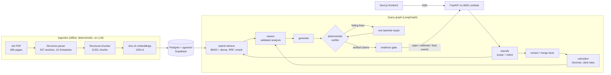

# TaxVerity

A grounded tax **advisor** for the **Income-tax Act, 2025 (India)**.

Most people don't know which lawful deductions, exemptions or regime choices
actually apply to them, and a generic LLM will advise confidently without
being checkable against the law. TaxVerity does the opposite: a user
describes a financial or tax situation in natural language, and the system
recommends what the Act actually supports — from the actual statutory text,
not the model's memorised knowledge — with traceable citations and
deterministic arithmetic. Where the Act doesn't address something, it says so
plainly instead of guessing.

The governing rule, from which most of the architecture follows:

> An unsupported claim is a correctness failure, not a quality issue.

## Architecture



- **Ingestion** parses the Act by its own structure (sections, sub-sections,
  clauses, Schedules, tables, cross-references) and makes one chunk per
  structural node, so every citation is a real provision path.
- **Retrieval** is BM25 and exact pgvector cosine search fused with RRF,
  reranked, plus a citation shortcut for provisions the user names and a
  statutory-term bridge for lay vocabulary. Each vendor step has a measured
  fallback (BM25 alone; fusion order).
- **Generation** writes one line per claim, citing evidence by `[n]`. A
  plain-Python verifier checks every line (markers resolve, every number
  appears in a cited passage, no modal reversal, application lines agree with
  the validated analysis) before it is released. Failing lines get one
  batched repair, then are withheld.
- **Arithmetic** is never done by the model: the calculator works in
  `Decimal` from rates that each carry a verbatim quote from the Act.

## Results

All numbers come from hand-labelled gold sets, measured by the
`scripts/measure_*.py` runs. Adoption rules and floors were fixed before each
run. The gold sets, measurement reports and Python test suite are kept out of
this repository.

**Retrieval** — 80 gold queries (citation / paraphrase / crossref /
negative slices), k = 10, lenient = an ancestor chunk also counts
(no rewrite, no classifier):

| Retriever | Recall@10 | MRR | nDCG@10 |
|---|---|---|---|
| BM25 | 0.602 | 0.496 | 0.502 |
| Dense (Jina v5) | 0.727 | 0.570 | 0.576 |
| Hybrid (RRF) + citation shortcut | 0.797 | 0.717 | 0.700 |
| + reranker | 0.812 | 0.750 | 0.727 |

Reranking lifts strict nDCG@5 from 0.417 to 0.565 and the crossref slice's
nDCG@5 from 0.348 to 0.536, at 606 / 1,126 ms p50 / p95. Hybrid + shortcut
search itself runs at 16 / 20 ms p50 / p95 excluding query embedding.

**Experiments measured and rejected:** one-hop cross-reference expansion
(paraphrase slice fell 0.821 → 0.804), HNSW indexing (changed 18 of 80 gold
rankings; exact scan p95 ~51 ms is inside budget). Expansion was later
re-admitted in a narrower form: after every hit is packed, leftover evidence
budget is filled with the provisions those hits refer to, so it never costs a
hit its place (evidence-pack coverage of gold citations 0.867 → 0.898 at a
3,000-token budget).

**Generation** — 81 items through the full graph (49 answerable, 16 negative,
8 calculation, 8 safety). Every served line was judged against only the
passages it cites (supported / partial / unsupported):

| Measure | Result |
|---|---|
| Answer rate (answerable items with a grounded claim) | 1.000 |
| False abstention (answerable) / abstention recall (negatives) | 0.000 / 0.938 |
| Safety cases correct | 8 / 8 |
| First-pass verifier pass rate / withheld after repair | 0.906 / 0.039 |
| Served claims: supported / partial / unsupported | 0.746 / 0.227 / 0.027 |
| Unsupported claims before the verifier gate | 0.065 |
| Gold citation coverage / citation hit rate | 0.837 / 0.898 |
| Key-point recall | 0.779 (0.830 after a figure-precision prompt fix) |
| Calculator exact match | 7 / 8 |
| Latency p50 / p95 | 5.1 s / 12.8 s |

Two floors fixed in advance were missed and are reported as missed:
unsupported served claims 0.027 against ≤ 0.02, and calculator exact match
7 / 8 against 8 / 8. The verifier gate cuts unsupported claims from 0.065 to
0.027; what remains are mostly figures applied to the wrong case, which number
grounding cannot see. The judge (Claude) agreed with 30 blind human labels at
Cohen's kappa 0.634. The judge saw the human labels on disputed rows before
re-judging, so that figure is optimistic.

**Standard RAG metric names** — how the usual metrics map onto ours. The
first two are DeepEval scores over the 62 answers that served a grounded
claim (gpt-5-mini judge, report-only, never a gate):

| Standard metric | Our metric | Result | Source |
|---|---|---|---|
| Faithfulness | served claims supported by their cited passages | 0.822 | DeepEval `FaithfulnessMetric` |
| Answer relevancy | answer addresses the question asked | 0.825 | DeepEval `AnswerRelevancyMetric` |
| Context relevancy | evidence-pack coverage of gold citations | 0.898 | deterministic, answer-gold set |
| Citation accuracy | gold citation coverage / citation hit rate | 0.837 / 0.898 | deterministic `cites_gold` checks |

DeepEval's faithfulness agrees only weakly with the calibrated claim judge
above (Spearman 0.218, kappa 0.155): its judge sometimes reasons from the
1961 Act and counts paraphrase as contradiction. The hot-path control is the
deterministic verifier gate, not either judge.

**Other components:**

| Component | Set | Result |
|---|---|---|
| Fact extraction (gpt-oss-120b) | 42 turns, 49 facts | strict 0.959, field F1 0.990, fabricated spans 0 / 45 |
| Safety classifier (gpt-oss-20b) | 34 cases | accuracy 0.971, refusal precision 1.000, recall 1.000 |
| Routing | 15 cases | 15 / 15 |
| Answer gate (advisor smoke) | 15 turns incl. guard scripts | guards pass: no negative or injection turn served a claim |

## Status and docs

Phases 0–18 are built: corpus, retrieval, calculator, generation with
grounding verification, accounts and threads, safety and scope, the LangGraph
query graph, API, frontend, AWS deployment and CI hardening (dependency audit,
Dependabot), followed by an answer-level generation evaluation (above).
Generation and repair run on OpenAI `gpt-5-mini`; classification, fact
extraction and reasoning run on Groq `gpt-oss` models, with Gemini as the
cross-vendor fallback. Operations are in [`docs/RUNBOOK.md`](docs/RUNBOOK.md); the
scope and refusal policy is [`docs/SAFETY_POLICY.md`](docs/SAFETY_POLICY.md).

The step-level roadmap and architecture decision records (`PLAN.md`,
`DECISIONS.md`) are maintained outside version control.

**Known limit:** the calculator is corpus-only (ADR-100) — it computes only
figures the 2025 Act itself prints, and routes to a text-only answer for
anything outside that (old-regime slabs, surcharge, marginal relief, cess).

## Corpus

`Income-tax-Act-2025.pdf` is expected at the repository root. It is **not**
tracked in git (101.8 MiB, over GitHub's per-file limit); obtain it from the
India Code portal and place it there. From Step 1.2 onward its content hash is
recorded in the corpus manifest, which is what actually pins the version.

## Development

Requires [uv](https://docs.astral.sh/uv/) and Python 3.13.

```bash
uv sync                  # create .venv, install deps and the package
uv run ruff check        # lint
uv run ruff format       # format
```

Postgres + pgvector for local development runs in Docker:

```bash
docker compose up -d --wait   # pgvector 0.8.6 on Postgres 17, 127.0.0.1:5432
```

Set `TAXVERITY_DATABASE_URL` in `.env` as shown in `.env.example`. Then create the schema and load the corpus:

```bash
uv run python scripts/migrate.py         # apply pending SQL migrations
uv run python scripts/ingest_corpus.py   # load chunks and vectors, idempotent
```

## Running the API in a container

`Dockerfile` builds the same image ECR/Lambda serves in production (ADR-076)
and the `api` service `compose.yaml` runs locally (Step 15.3) — no separate
dev image. It needs `TAXVERITY_JINA_API_KEY`, `TAXVERITY_GROQ_API_KEY` and
`TAXVERITY_JWT_SECRET` set in `.env`, and the database migrated and loaded
per the steps above.

```bash
docker compose up -d --wait   # postgres, then the api image (builds if needed)
curl http://127.0.0.1:8080/health
```

**Measured once (2026-09-14), against the real corpus** — 8,351 chunks, one
embedding set — not asserted in CI (Step 15.5): image size **1.01 GB** (no
torch — ADR-075 moved embeddings and reranking off this image); cold
container start to a passing `/health` (chunk hydration, BM25 build, pgvector
index, term bridge, LLM/reranker client construction) **~3.8 s**, well inside
Lambda's 10 s INIT budget (ADR-076).
